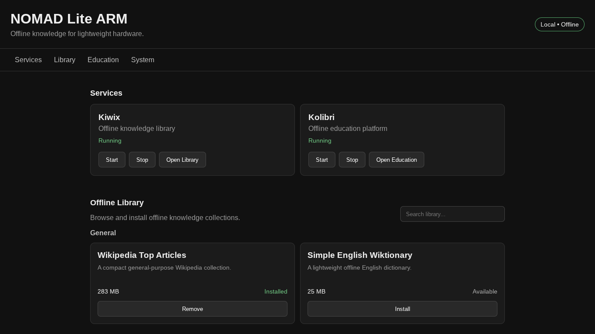

# NOMAD Lite ARM

**A lightweight offline knowledge and education platform for ARM64 Linux devices.**

NOMAD Lite ARM is a local-first toolkit designed to turn inexpensive, low-power ARM64 hardware into a portable offline information and education system.

The project combines offline reference libraries, structured educational content, lightweight local services, and a simple web dashboard into an environment designed for devices such as Raspberry Pis, ARM64 single-board computers, Chromebooks, cyberdecks, and other resource-constrained Linux systems.

NOMAD Lite is inspired by Project NOMAD by Crosstalk Solutions, but is an independent project focused on lightweight ARM64 Linux hardware.

> **Project Status:** Active development. The current version is being developed and tested on Debian 12 ARM64. Other ARM64 devices and Linux distributions have not yet been fully tested.

<p align="center">
  
</p>

## Why NOMAD Lite?

Powerful offline knowledge systems should not require powerful computers.

NOMAD Lite is being designed around a few core principles:

* Run on inexpensive, low-power ARM64 hardware
* Remain useful without an internet connection
* Keep storage requirements configurable
* Use lightweight and open-source software where practical
* Combine reference material with structured educational content
* Support portable and removable storage
* Provide a simple interface for managing local services and content

The goal is to create a system that can be useful on a small laptop, Raspberry Pi, single-board computer, or custom cyberdeck without requiring high-end hardware or permanent internet access.

## Current Features

### Offline Reference Library

NOMAD Lite uses **Kiwix** to serve offline ZIM archives locally.

The library system currently supports:

* Browsing available offline collections
* Viewing installed collections
* Viewing collection information
* Displaying download and storage sizes
* Downloading collections
* Resuming interrupted downloads
* Removing installed collections
* Starting and stopping the Kiwix service

This allows reference material such as encyclopedias and educational resources to remain available without an internet connection.

### Offline Education

NOMAD Lite integrates **Kolibri** for structured offline educational content.

The education system currently supports:

* Browsing available courses
* Viewing course information
* Viewing estimated download and installed sizes
* Installing individual courses
* Tracking installed education content
* Starting and stopping Kolibri

### Local Dashboard

NOMAD Lite includes a lightweight local web dashboard for managing the system.

The dashboard currently provides access to:

* System information
* Kiwix status and controls
* Kolibri status and controls
* Offline reference libraries
* Educational content
* Download and installation status

The dashboard runs locally and does not depend on an external web service.

### Command-Line Interface

NOMAD Lite can also be controlled from the terminal using the main `nomad` command.

Examples:

```bash
./nomad start
./nomad stop
./nomad restart
./nomad status
```

Service controls:

```bash
./nomad kiwix start
./nomad kiwix stop
./nomad kiwix status

./nomad education start
./nomad education stop
./nomad education status
```

Library management:

```bash
./nomad library list
./nomad library installed
./nomad library info NAME
./nomad library install NAME
./nomad library remove NAME
```

Other tools (I recommend starting dashboard for full the experience!):

```bash
./nomad system
./nomad dashboard
```

## Requirements

NOMAD Lite currently targets **64-bit ARM Linux systems**, also known as **ARM64** or **AArch64**.

Current software requirements include:

* ARM64 / AArch64 processor
* Debian-based Linux environment
* Bash
* Python 3
* Kiwix / `kiwix-serve`
* Kolibri
* `curl`
* Standard GNU/Linux command-line utilities

The dashboard currently relies primarily on Python's standard library and does not require a separate Python dependency file.

### Current Compatibility

NOMAD Lite is currently developed and tested on:

* ARM64 / AArch64
* Debian 12
* ChromeOS Linux Development Environment

Other ARM64 Linux devices, including Raspberry Pi-class hardware and other single-board computers, are intended targets but should currently be considered **untested** until compatibility is verified.

32-bit ARM systems are not currently supported.

## Installation

NOMAD Lite currently supports automated setup on **Debian 12 ARM64/AArch64** systems.

Clone the repository:

```bash
git clone https://github.com/CarlopeFan77/nomad-lite-arm.git
cd nomad-lite-arm
```

Before installing anything, you can check whether your system already meets the current requirements:

```bash
./install.sh --check
```

To install the required dependencies and prepare NOMAD Lite:

```bash
./install.sh
```

The installer currently:

* Verifies that the system is running ARM64/AArch64
* Verifies Debian 12 compatibility
* Installs required core packages
* Installs Kiwix support
* Installs Kolibri when needed
* Prepares NOMAD Lite directories and script permissions
* Verifies the installation when finished

The installer can safely be run again if the required packages are already installed.

After installation, check the system with:

```bash
./nomad status
```

Then launch the local dashboard with:

```bash
./nomad dashboard
```

NOMAD Lite determines its project directory dynamically, so the repository does not need to be cloned into a specific location.

> **Note:** The automated installer currently targets Debian 12 ARM64 systems. Additional Linux distributions and ARM64 hardware will be supported as they are tested.


## Project Structure

```text
nomad-lite-arm/
├── config/       # Library and education catalogs
├── dashboard/    # Local web dashboard
├── data/         # Local content and application state
├── scripts/      # Service and library management scripts
├── nomad         # Main NOMAD Lite command
├── LICENSE
└── README.md
```

## Roadmap

Current development priorities include:

* Raspberry Pi and additional ARM64 hardware testing
* External and removable storage support
* Expanded offline reference library
* Expanded offline education catalog
* Improved dashboard controls and status reporting
* Interactive installation and optional component selection
* Additional lightweight offline tools
* Packaged releases for easier installation

Longer-term, the goal is to make NOMAD Lite a flexible platform for building portable offline knowledge systems on inexpensive ARM64 hardware.

## Potential Use Cases

NOMAD Lite is being designed for environments such as:

* Raspberry Pi systems
* ARM64 single-board computers
* Cyberdecks and portable computing builds
* Low-cost ARM laptops and Chromebooks
* Offline educational systems
* Portable reference libraries
* Emergency and disconnected information systems
* Homelabs
* Field computing
* Self-hosted experimentation

## Contributing

NOMAD Lite ARM is still early in development, and testing on additional ARM64 hardware is especially valuable.

Bug reports, compatibility results, feature suggestions, documentation improvements, and code contributions are welcome.

See [CONTRIBUTING.md](CONTRIBUTING.md) for development setup, testing guidelines, and contribution information.

## License

NOMAD Lite ARM is licensed under the **Apache License 2.0**.

See the `LICENSE` file for details.

## Acknowledgements

NOMAD Lite ARM is inspired by **Project NOMAD by Crosstalk Solutions**.

This repository is an independent project and is not affiliated with or endorsed by Crosstalk Solutions.
